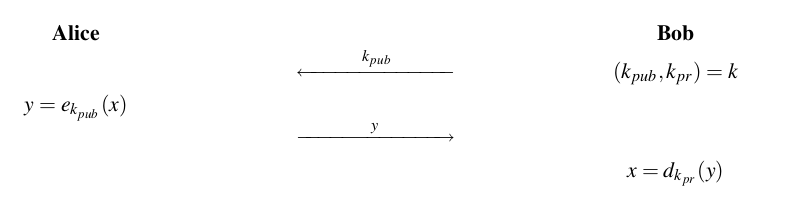
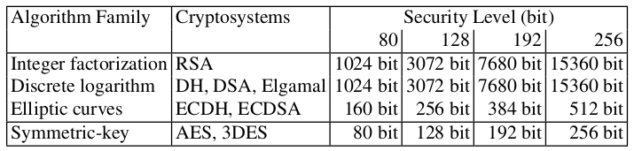
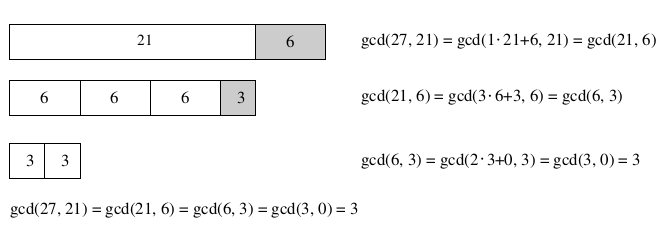

# Chapter 6 Introduction to Public-Key Cryptography

- [Chapter 6 Introduction to Public-Key Cryptography](#chapter-6-introduction-to-public-key-cryptography)
  - [Symmetric vs. Asymmetric cryptography](#symmetric-vs-asymmetric-cryptography)
    - [Symmetric Cryptography Revisited](#symmetric-cryptography-revisited)
    - [Principles of Asymmetric Cryptography](#principles-of-asymmetric-cryptography)
    - [Key Lengths and Security Levels](#key-lengths-and-security-levels)
  - [Math topics](#math-topics)
    - [Euclidean Algorithm](#euclidean-algorithm)
    - [Extended Euclidean Algorithm](#extended-euclidean-algorithm)
    - [Euler's Phi Function](#eulers-phi-function)
    - [Fermat’s Little Theorem and Euler’s Theorem](#fermats-little-theorem-and-eulers-theorem)

## Symmetric vs. Asymmetric cryptography

### Symmetric Cryptography Revisited

**Properties:**

- Same secret key for encryption and decryption.
- Encryption and decryption function are very similar.

**Analogy:** a safe with one lock.

**Problems:**

- Key distribution problem. The key must be established between parties using a secure channel (can't send the key over the channel directly).
- Large number of keys: each pair of users needs a separate pair of keys. For network with $n$ users, there are: $\binom{n}{2}=\frac{n \cdot (n-1)}{2}$ key pairs, and every user has to store $n-1$ keys (for $n = 2000$ you have to generate $\binom{2000}{2} = 1\ 999\ 000$ key pairs).
- No protection against cheating by Alice or Bob. Alice and Bob have the same capabilities, since they possess the same key. Non-repudiation (proving that Alice actually sent a certain message) can be achieved using digital signatures.

### Principles of Asymmetric Cryptography

Asymmetric cryptography = public-key cryptography

**General idea:** It is not necessary that the key possessed by a person who encrypts the message (Alice) is secret. The crucial part is that Bob, the receiver, can only decrypt using a secret key.



**Analogy:** a safe with public lock for depositing a message and a secret lock for retrieving, e.g. a mailbox.

Public-key algorithms are built from one common principle, the *one-way function*.

> A function $f()$ is one-way function if:
>
> 1. $y = f(x)$ is computationally easy (can be evaluated in polynomial time)
> 2. $x = f^{−1} (y)$ is computationally infeasible (can't be evaluated in 10000 years using the best known algorithm)

There are two popular one-way functions:

1. integer factorization problem
2. discrete logarithm problem

**Security Mechanisms:**

- Key establishment (establishing secret keys over an insecure channel).
- Nonrepudiation and message integrity.
- Identification.
- Encryption.

**Problems:**

- The encryption of data is extremely slow.
- Authenticity of public keys. Do we really know that a certain public key belongs to a certain person?
- Long keys.

Most practical protocols are hybrid protocols which incorporate both symmetric and public-key algorithms.

### Key Lengths and Security Levels

In order to compare different algorithms, one often considers the security level. An algorithm is said to have a *"security level of n bit"* if the best known attack requires $2^n$ steps.



In order to provide long-term security, i.e., security for a timespan of several decades, a security level of 128 bit should be chosen.
The computation complexity of the three main asymmetric algorithm families grows roughly with the cube bit length $\approx \Omicron(n^3)$.

## Math topics

### Euclidean Algorithm

The gcd of two numbers is the largest positive number that divides both numbers.



At each iteration we reduce the problem of finding the gcd of two given numbers to that of the gcd of two smaller numbers.

```python
def gcd(a: int, b: int) -> int:
    if a < b:
        a, b = b, a
    while b:
        a, b = b, a % b
    return a
```

The number of iterations is close to number of digits (base 2) of the input operands.

### Extended Euclidean Algorithm

An extension of the EA allows us to *compute modular inverses*.

In addition to computing the gcd, the extended Euclidean algorithm (EEA) computes a linear combination of the form: $gcd(r_0, r_1) = s \cdot r_0 + t \cdot r_1$ where $s$ and $t$ are integer coefficients.

The idea behind the algorithm is that we execute the standard EA, but we express the current remainder $r_i$ as a linear combination of the form $r_i = s_i r_0 + t_i r_1$. If we succeed with this, we end up in the last iteration with the equation: $r_l = gcd(r_0, r_1) = s_l r_0 + t_l r_1 = s \cdot r_0 + t \cdot r_1$.

```python
def xgcd(a: int, b: int) -> tuple[int, int, int]:
    r = [b, a]
    s = [0, 1]
    t = [1, 0]

    while r[-1]:
        q = r[-2] // r[-1]
        r[-2], r[-1] = r[-1], r[-2] % r[-1]
        s[-2], s[-1] = s[-1], s[-2] - q * s[-1]
        t[-2], t[-1] = t[-1], t[-2] - q * t[-1]

    return r[-2], s[-2], t[-2]
```

If $gcd(r_0, r_1) = 1$, we can easily find the inverse of $r_1 \mod r_0$:

$$
\begin{align*}
s \cdot r_0 + t \cdot r_1 &= 1 \\
s \cdot 0 + t \cdot r_1 &\equiv 1 \mod r_0 \\
r_1 \cdot t &\equiv 1 \mod r_0 \\
t &= r_1^{−1} \mod r_0
\end{align*}
$$

If we need to compute inverse $a^{−1} \mod m$, we apply the EEA with the input parameters $m$ and $a$. The output value $t$ that is computed is the inverse. The $s$ coefficient is not needed and is in practice often not computed. Result of algorithm can be a negative value for $t$. In this case, we have to compute $t = t + r_0$.

```python
def minv(a: int, m: int) -> int:
    gcd, _, t = xgcd(m, a)
    if gcd == 1:
        return t % m
    raise ValueError("inverse does not exist")
```

The EEA can be used completely analogously with polynomials instead of integers.

### Euler's Phi Function

> **Euler's Phi Function**
> The number of integers in $Z_m$ relatively prime to m is denoted by $\Phi(m)$.

If we know factorization of $m$ we can quickly calculate $\Phi(m)$.

> Let $m$ have the following canonical factorization:
> $m = p_1^{e_1} \cdot p_2^{e_2} \cdot \dots \cdot p_n^{e_n}$,
> where the $p_i$ are distinct prime numbers an $e_i$ are positive integers, then:
> $\Phi(m) = \prod_{i=1}^{n} (p_i^{e_i} − p_i^{e_{i-1}})$

The alternative way to calculate $\Phi(m)$ requires to evaluate the gcd $m$ times. This is completely out of reach for the large numbers.

### Fermat’s Little Theorem and Euler’s Theorem

Fermat's Little Theorem is helpful for primality testing and in many other aspects of public-key cryptography.

> **Fermat's Little Theorem**
> Let a be integer and p be a prime, then:
> $a^p \equiv a \mod p$

The theorem can be stated in the form:
$a^{p−1} \equiv 1 \mod p$
which is often useful in cryptography.

One application is the computation of the inverse in a finite field (holds only if $p$ is prime):
$a^{−1} \equiv a^{p−2} \mod p$
Performing the exponentiation using Fermat's theorem is usually slower than using the EEA, unless special hardware is involved (e.g. on smart cards which have a hardware accelerator for fast exponentiation anyway) but is easier to make constant-time.

A generalization of Fermat’s Little Theorem to any integer moduli, i.e., moduli that are not necessarily primes, is Euler’s theorem.

> **Euler's theorem**
> Let a and m be integers with $gcd(a, m) = 1$ , then:
> $a^{\phi(m)} \equiv 1 \mod m$
